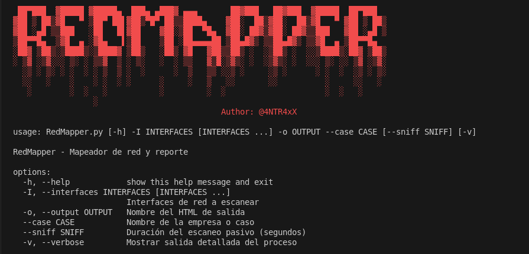

# RedMapper

**RedMapper** es una herramienta de mapeo de red para pentesters. Combina escaneo pasivo y activo para identificar dispositivos en la red, obtener información del sistema operativo, puertos abiertos, generar un reporte en HTML y visualizar la topología en un grafo.




  


---

## 🛠️ Requisitos

- Python 3.8+
- Acceso como administrador/root
- Permisos de red (libpcap en Linux o WinPcap/Npcap en Windows)

## 📦 Instalación y entorno virtual

```bash
# 1. Clonar el repositorio
git clone https://github.com/4NTR4xX01/redmapper.git

# 2. Crear y activar entorno virtual
python -m venv venv
# Linux/macOS:
source venv/bin/activate
# Windows:
venv\Scripts\activate

# 3. Instalar dependencias
pip install -r requirements.txt
```

## ⚙️ Uso:

```bash
sudo env "PATH=$VIRTUAL_ENV/bin:$PATH" python3 RedMapper.py -I eth0 -o reporte.html --case "Tecnologia y Ciberseguridad" --verbose
```


## 🔧 Opciones:

| Opción    | Descripción                                           | Obligatorio |
| --------- | ----------------------------------------------------- | ----------- |
| `-I`      | Interfaces de red a escanear (puedes poner varias)    | ✅ Sí        |
| `--case`  | Nombre de la empresa o caso                           | ✅ Sí        |
| `-o`      | Nombre del archivo HTML de salida                     | ✅ Sí        |
| `--sniff` | Duración del escaneo pasivo en segundos (default: 30) | ❌ No        |
| `-v`      | Modo verbose para ver detalles del proceso            | ❌ No        |


## 🧑‍💻 Autor:
@4NTR4xX
Apasionado por la ciberseguridad y el pentesting.
